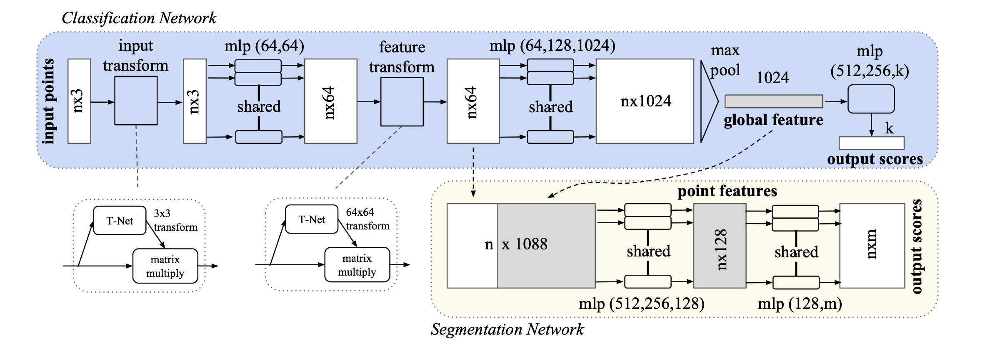

# Point Net | Cloud Point Segmentation

 

## Overview

This repository contain my own implementation of the [paper](https://arxiv.org/abs/1612.00593) `PointNet: Deep Learning on Point Sets for 3D Classification and Segmentation`  
All the theoretical will be process through a blog (loading ...)

## Table of Contents

- [Prerequisites](#prerequisites)
- [Project Structure](#project-structure)
- [Installation](#installation)
- [Contributing](#contributing)
- [License](#license)

## Prerequisites

Before you begin, ensure you have the following dependencies installed:

- Python 3.x
- PyTorch
- NumPy
- Matplotlib (for visualization)
- Open3d

## Project Structure
All the content is avaiable under the src folder. For now, only the model is available and the dataset. No training loop have been created for now.

## Installation
Clone the repository:
```bash
git clone https://github.com/camaltra/personnal_ml.git
cd personnal_ml/point_net
```
Install the required packages as mentioned in the Prerequisites section.   
Use the model as you need.

## Contributing
Contributions are welcome! If you have any suggestions, improvements, or find issues, please create a new issue or a pull request.

## License
This project is licensed under the MIT License - see the LICENSE file for details.