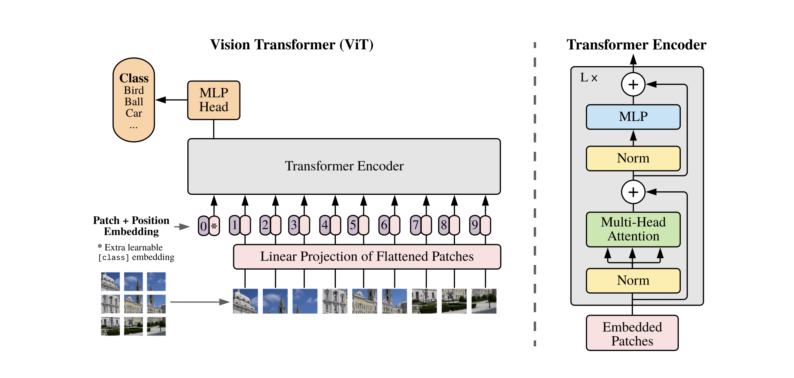

# Vision Transformer

 

## Overview

This repository is my own implementation of the Vision Transformer from the [paper](https://arxiv.org/abs/2010.11929) `AN IMAGE IS WORTH 16X16 WORDS: TRANSFORMERS FOR IMAGE RECOGNITION AT SCALE`  
All the theoretical part are in the linked [blog](https://medium.com/@mickael.boillaud/vision-transformer-from-scratch-using-pytorch-d3f7401551ef)

## Table of Contents

- [Prerequisites](#prerequisites)
- [Project Structure](#project-structure)
- [Installation](#installation)
- [Use](#use)
- [Results and Improvment](#results-and-improvment)
- [Contributing](#contributing)
- [License](#license)

## Prerequisites

Before you begin, ensure you have the following dependencies installed:

- Python 3.x
- PyTorch
- NumPy
- Matplotlib (for visualization)
- Tensorboard
- tqdm
- albumentations

You can install the required Python packages using `conda`: (/!\ This is a requirement file based from `osx-arm64`, it can be different if you are on other device architecture)

```bash
conda create --name <env> --file requirements.txt
```

## Project Structure


All file that contain code are available under the `src` folder

`data_prep.py`: This script handles the raw data provided by Kaggle, separating the dataset into two subsets. The training dataset consists of 95% of the raw data, ensuring equal class representation, while the validation dataset comprises the remaining 5%.
```bash
python data_prep.py
```

`config.py`: This configuration file controls both training and inference parameters. Customize it to suit your needs.

`train.py`: This script is used for training the Vision Transformer on the `cat vs dog` dataset. To start training, run:
```bash
python train.py
```

`model/vit.py`: The most intersting part, the implementation of the ViT model using only built-in pytorch blocks. The whole ViT is cut into subpart such as `Embedding`, `MSA`, `MLP`, `Transformer Encoder`

## Installation
Clone the repository:
```bash
git clone https://github.com/camaltra/personnal_ml.git
cd personnal_ml/vision_tranformer
```
Install the required packages as mentioned in the Prerequisites section.  
Download the [cat vs dog dataset](https://github.com/yhlleo/RoadNet) and place it in a directory named `./data`  
Rename the folder `/train` into `/row_data`  
Run the data preparation script and you good to go


## Use

Then to train the Vision Transformer, execute the following command
```bash
python train.py
```
Make sure to personalize the training part by changing some parameter into the `config.py` file
## Results and Improvment

They are discussed in the linked blog

## Contributing
Contributions are welcome! If you have any suggestions, improvements, or find issues, please create a new issue or a pull request.

## License
This project is licensed under the MIT License - see the LICENSE file for details.
